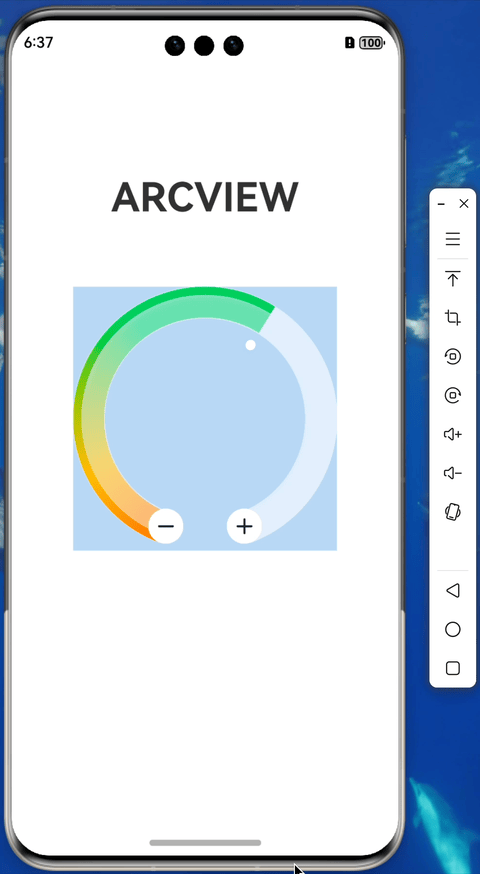

## arcview

> [https://github.com/krmao/arcview](https://github.com/krmao/arcview)

### install

```shell
ohpm install arcview
```

### usage

- ArcProgressView
    ```typescript
    import { ANGLE_DEGREE, ArcColors, ArcProgressView, pp } from 'arcview';

    @State
    public isDebug: boolean = true;
    public enableGesture: boolean = true;
    public enableIndicator: boolean = true;
    public steps: number = 10;
    public bgColor: string = '#BED7F2';
    public maxAngleDegree: ANGLE_DEGREE = 320; // 最大角度 度
    @Watch('onCurAngleDegreeChanged')
    @State
    public curAngleDegree: ANGLE_DEGREE = 320 / 10 * 5; // 当前角度 度 [minAngleDegree, maxAngleDegree]
    public widthVp: number = pp(256); // 整个画布的宽 外圆直径 vp
    public heightVp: number = pp(256); // 整个画布的高 外圆直径 vp
    public bgColors: Array<[string, number]> = [
      ["#80FFFFFF", 0.00],
      ["#80FFFFFF", 1.00],
    ]
    public arcOuterColors: Array<[string, number]> = ArcColors.arcOuterColors;
    public arcInnerColors: Array<[string, number]> = ArcColors.arcInnerColors;
  
    public onCurAngleDegreeChanged() {
      Logger.info(this.TAG, 'onCurAngleDegreeChanged curAngleDegree=' + this.curAngleDegree);
    }
  
    ArcProgressView({
      isDebug: this.isDebug,
      enableGesture: this.enableGesture,
      enableIndicator: this.enableIndicator,
      steps: this.steps,
      bgColor: this.bgColor,
      maxAngleDegree: this.maxAngleDegree,
      curAngleDegree: this.curAngleDegree,
      widthVp: this.widthVp,
      heightVp: this.heightVp,
    })
      .onClick(() => {
        this.isDebug = !this.isDebug;
      })
    ```
  
- ArcView
    ```typescript
    import { ArcProgressView, ArcView, pp } from 'arcview';
    
    ArcView({
          isDebug: this.isDebug,
          strokeWidthVp: this.arcViewUtilForIndicator().strokeWidthVp,
          colors: [["#00000000", 0.00], ["#00000000", 1.00]],
          enableOriginAngle: true,
          disableClip: true,
          maxAngleDegree: this.arcViewUtilForIndicator().maxAngleDegree,
          curAngleDegree: this.curAngleDegree,
          widthVp: this.widthVp - pp(30 * 2),
          heightVp: this.heightVp - pp(30 * 2),
          gaugeIndicatorOptions: { icon: $r("app.media.icon_indicator"), space: 5 },
      })
    ```

### features

- support always vertical
- support custom max angle degree
- support custom buttons
- support debug log and views
- support gesture progress in scrollView with no conflict
- support ArcView just show
- support ArcProgressView with gesture progress
- support arc gradient colors clip
- support indicator

### preview

- 